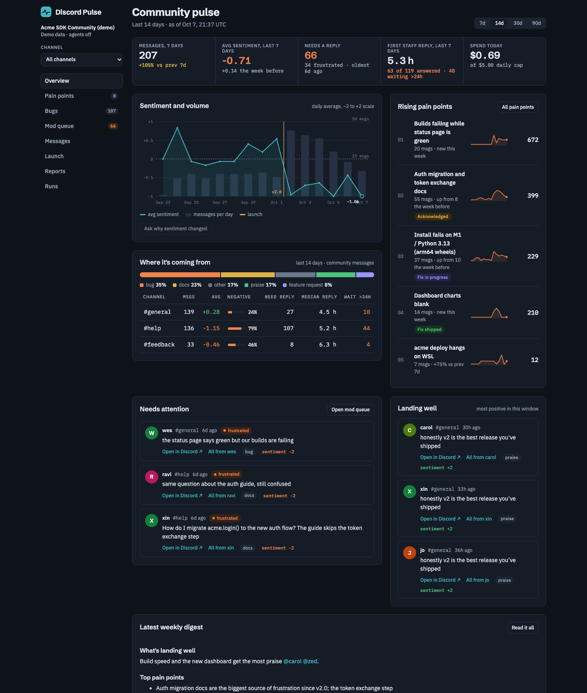
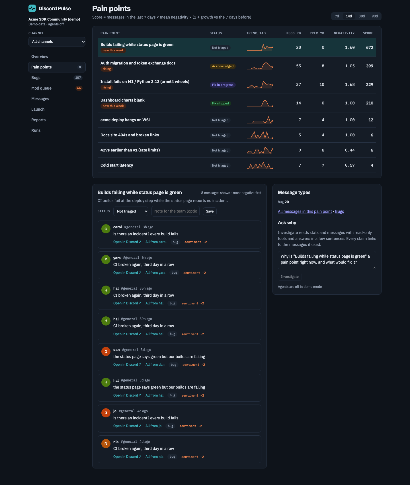
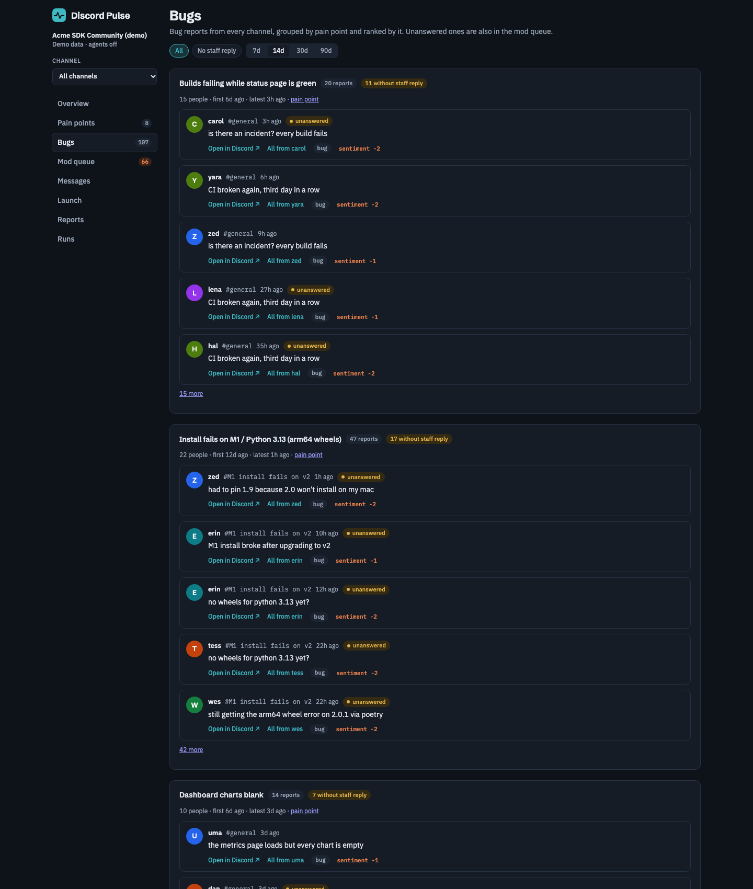
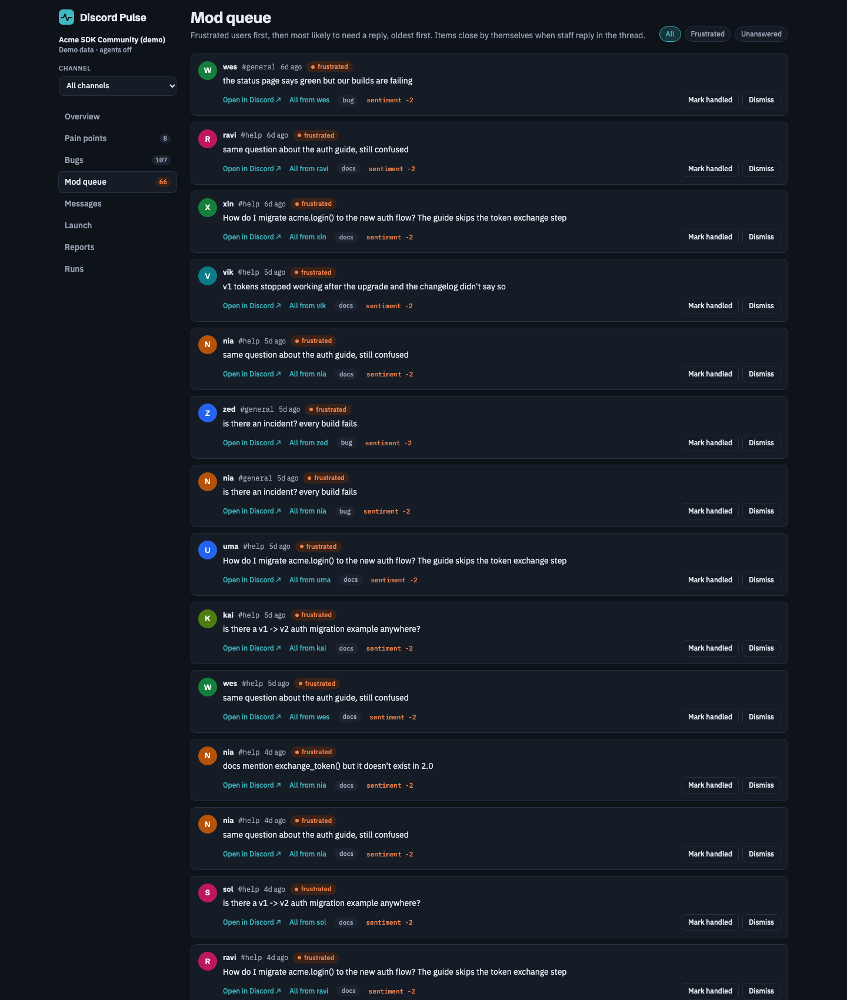
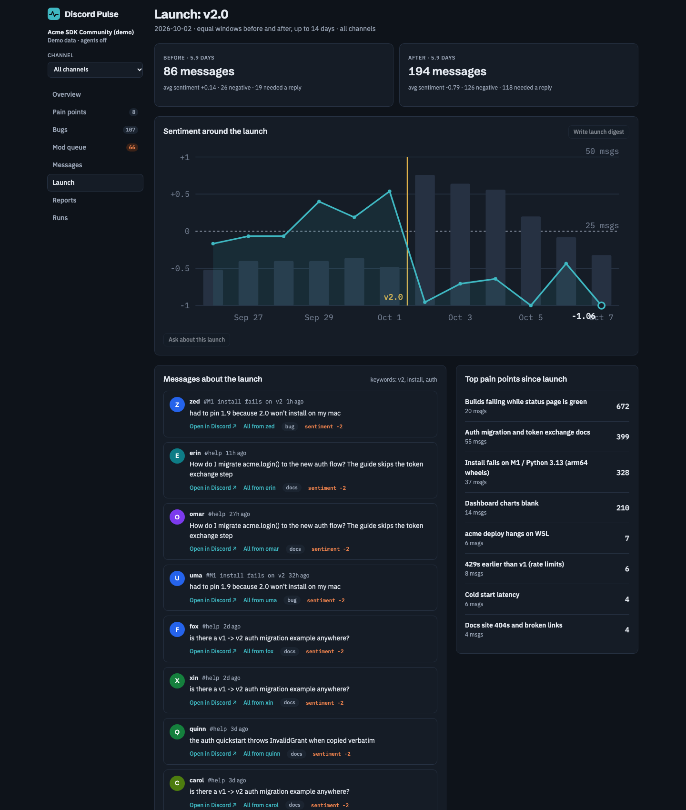
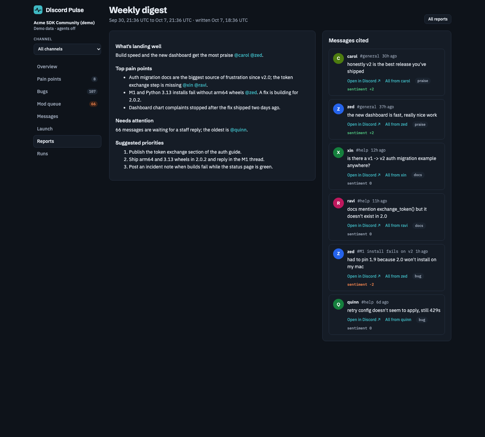
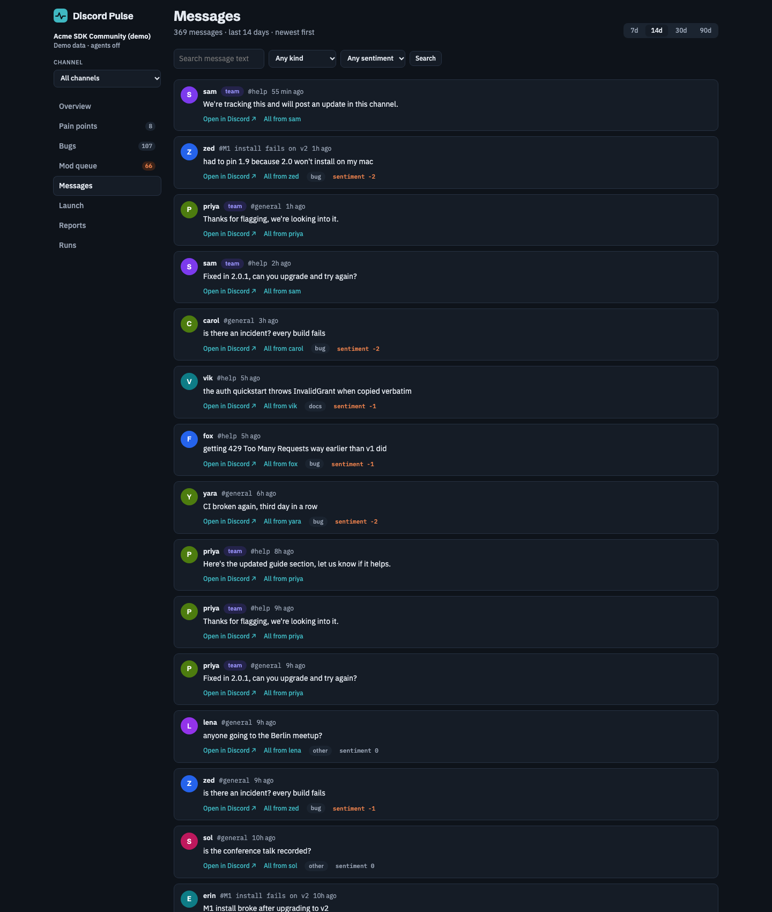
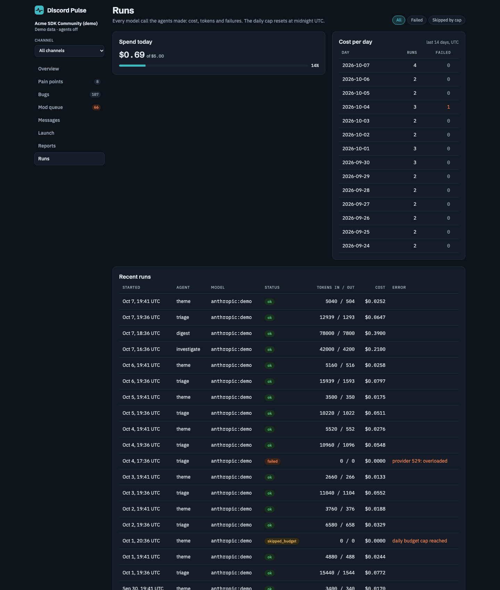

# Discord Pulse

Internal DevRel tool: how a product's Discord community feels, which pain points recur, and who still needs a reply. Analysis is done by LLM subagents (Anthropic, OpenAI, or OpenRouter, chosen per agent).

## Screenshots

All screenshots use the built-in demo dataset (a made-up "Acme SDK" community from `python -m pulse.run seed-demo`), not real server data.

| Overview | Pain points |
|---|---|
|  |  |

| Bugs | Mod queue |
|---|---|
|  |  |

| Launch | Weekly digest |
|---|---|
|  |  |

| Messages | Runs |
|---|---|
|  |  |

## Setup

```bash
uv venv --python 3.12 .venv
uv pip install -e '.[dev]'
cp pulse.toml.example pulse.toml   # then edit
export ANTHROPIC_API_KEY=...       # and/or OPENAI_API_KEY, OPENROUTER_API_KEY
```

## Getting messages in

Drop export files into `imports/`:

- DiscordChatExporter JSON (one file per channel or thread), or
- CSV with columns `guild_id,channel_id,message_id,author_id,author_name,content,created_at` and optional `reply_to_id,thread_id,channel_name,author_avatar_url,is_bot,edited_at,parent_channel_id`.

Re-importing is safe: messages are keyed on Discord's message id, and edited messages are re-triaged.

**Terms of Service warning:** this tool never reads Discord with a user account token. Exporters that run on your user token count as self-botting under Discord's Terms of Service and can get the account banned. The supported live route is a read-only bot added by a server admin (coming in a later release).

## Commands

```bash
.venv/bin/python -m pulse.run ingest              # import files from imports/
.venv/bin/python -m pulse.run triage              # label new messages
.venv/bin/python -m pulse.run triage --since 2026-09-01 --force   # re-label a range
.venv/bin/python -m pulse.run modqueue            # refresh who needs a reply
.venv/bin/python -m pulse.run pipeline            # all of the above, then themes
```

`--since` dates are treated as UTC midnight. `--force` requires `--since` (re-triaging your whole history isn't allowed by accident).

Spending is capped by `[budget] daily_usd_cap`; once reached, agent calls stop for the day and the run says so. The cap resets at UTC midnight.

## Dashboard

```bash
python -m pulse.run web              # http://127.0.0.1:8321, reads pulse.toml, agents on
python -m pulse.run seed-demo        # writes demo.db: a synthetic community, no keys needed
python -m pulse.run web --demo       # serves demo.db with agents off (good for pitching)
```

Views: Overview, Pain points, Bugs, Mod queue, Messages, Launch, Reports, Runs. Every view takes a window (7, 14, 30 or 90 days) and a channel; a channel includes its threads. Every message shows its author and an "Open in Discord" link, and "All from <author>" lists everything that person said.

- **Reply times**: median minutes to the first staff reply and how many messages have waited more than 24 hours, overall and per channel.
- **Pain point status**: mark a pain point Acknowledged, Fix in progress or Fix shipped with a note. Once shipped, the view compares volume and sentiment before and after.
- **Investigate and digests from the dashboard** run in the background and the page updates when they finish. They spend from the same daily cap as the pipeline; the Runs view shows every call and its cost.
- Messages imported before this version count under their own thread id when you filter by channel; re-run `ingest` once to attach threads to their parent channel.
- The dashboard has no login. It binds to 127.0.0.1 by default; don't expose it to the internet.
- `web` starts without provider keys; the agent buttons are then off and say which key to set.

## Jev first pass (optional)

With `[classifier] enabled = true`, triage asks Jev (a cheap closed-set classifier, via OpenRouter) about every message first. Confident, low-stakes messages are labelled by Jev alone; anything negative, likely to need a reply, a bug, docs issue, feature request or praise, or low-confidence, still goes to the triage LLM for full labels and topics. Staff messages are always neutral. If Jev fails on a message, the LLM handles it.

Measured on synthetic data this cut triage cost by roughly 2-3x at the same needs-reply accuracy (see `docs/benchmarks/`). Re-check on your own data before relying on it.

List the mod queue, highest priority first, with links to each message:

```bash
.venv/bin/python -m pulse.run queue --limit 20
```

## Accuracy check

`python -m pulse.eval` runs triage on a hand-labelled set and reports, per model: exact sentiment, sentiment within one step, kind macro-F1, needs-reply recall, precision and agreement, messages left unlabelled by failures, and cost. It uses a throwaway in-memory database, so `pulse.db` is never touched, and `--max-usd` (default $1) caps each model's run.

```bash
.venv/bin/python -m pulse.eval --gold eval/gold.example.jsonl                          # the shipped synthetic set
.venv/bin/python -m pulse.eval --sample 200 --out eval/gold.jsonl                      # start your own set
.venv/bin/python -m pulse.eval --model anthropic:claude-haiku-4-5-20251001 --model openai:gpt-5.4-mini --model jev:jev-latest --model hybrid
```

`--sample` writes random messages from your database with empty labels; fill in `sentiment` (-2 to 2), `kind` and `needs_reply` for each, then run the check. Rows with a `null` label are skipped and counted. Run it before changing a prompt or provider. With the classifier enabled, any `jev:` row below 90% needs-reply agreement prints a recommendation to set `[classifier] enabled = false`.

## Live bot

When the mod team has added the read-only bot (see `docs/bot-pitch.md` for the one-page pitch and setup), install the extra and set the token:

```bash
.venv/bin/pip install -e '.[bot]'
export DISCORD_BOT_TOKEN=...                                   # from the Developer Portal, never in pulse.toml
.venv/bin/python -m pulse.run bot-invite --client-id <app id>  # the read-only invite link
.venv/bin/python -m pulse.run ingest --source bot              # one-off catch-up, then exit
.venv/bin/python -m pulse.run bot                              # catch up, then stream until Ctrl-C
```

Both read only channels the bot can see, narrowed by `[server] channel_ids`. A channel read for the first time goes back `[bot] backfill_days` (default 30); after that each run continues from the last stored message, so a restart or disconnect never leaves a gap. Edits are picked up for messages the bot has seen since it started (discord.py keeps about the last 1,000); older edits are caught on the next file import. `pipeline` and the dashboard work the same whether messages came from exports or the bot.

## Scheduled runs (macOS)

```bash
.venv/bin/python -m pulse.run schedule show                 # print the launchd jobs without installing
.venv/bin/python -m pulse.run schedule install [--with-bot] # pipeline every 30 min, digest Mondays 09:00
.venv/bin/python -m pulse.run schedule uninstall
```

launchd does not see your shell's environment, so each job loads `~/.config/discord-pulse/env` (change it with `--env-file`) before it runs. Put `export NAME=value` lines for the keys you use in that file and keep it `chmod 600`; the keys are never copied into the plists. Write values in single quotes if they contain spaces or $ (export NAME='value'). Logs go to `logs/` next to `pulse.toml`.

## Send a pain point to GitHub or Linear

Add `[integrations.github]` (`repo`, optional `labels`) or `[integrations.linear]` (`team_id`) to `pulse.toml` and set `GITHUB_TOKEN` (a fine-grained token with Issues: write on that repo) or `LINEAR_API_KEY`. Then use the button on a pain point, or:

```bash
.venv/bin/python -m pulse.run issue 7 --to github --dry-run   # see exactly what would be posted
.venv/bin/python -m pulse.run issue 7 --to github
```

The issue holds the pain point's summary, counts, status and up to 8 message excerpts with Discord links. It names no authors, and `@` mentions are defused. Each pain point is sent at most once per tracker; asking again returns the existing link. Check `--dry-run` before posting to a public repo.

## Slack alerts

Create a Slack incoming webhook, set `SLACK_WEBHOOK_URL`, and set `[alerts] enabled = true`. Each `pipeline` run then posts:

- a pain point that is spiking (at least `spike_min_volume` messages in 24 hours and `spike_trend` times more than the 24 hours before), at most once a day per pain point;
- a frustrated message that has gone `frustrated_hours` without a staff reply, once per mod queue item.

At most 10 alerts go out per run; a failed post is retried next run. `python -m pulse.run alerts --dry-run` shows what would be posted.

## Themes, digests, investigations

```bash
.venv/bin/python -m pulse.run themes                         # group labelled messages into pain points
.venv/bin/python -m pulse.run digest                         # weekly digest
.venv/bin/python -m pulse.run digest --launch "v2.0 SDK"     # before/after a [[launches]] entry
.venv/bin/python -m pulse.run investigate "why did sentiment dip on Tuesday?"
```

`pipeline` runs ingest, triage, the mod queue, then `themes` (the queue goes first so a theme failure never blocks it). Themes are proposed by the `theme` model (with Jev assigning messages to existing themes when the classifier is enabled); at most 5 new themes and 3 merges are made per UTC day across all runs, messages proposed for a theme over the limit are retried on a later run, and every change is logged. Digests and investigations cite real messages; the CLI prints each citation as the author and a link to the message, and drops any citation to a message the agent was not shown.

### Costs

All agents share `[budget] daily_usd_cap`.

- `digest` calls the `[models] digest` model once per digest (in the example config, the priciest tier). A period with no community messages and no open mod queue items is saved without a model call.
- `investigate` makes up to 13 model steps (12 tool calls plus a final answer), each re-sending a growing transcript. On a mid-tier model, budget roughly 10-25% of a $5 day per question.
- `themes` runs Jev once per candidate message (when the classifier is enabled and themes exist), plus one `theme` model call per 60 leftover messages.

## Tests

```bash
.venv/bin/pytest
```
